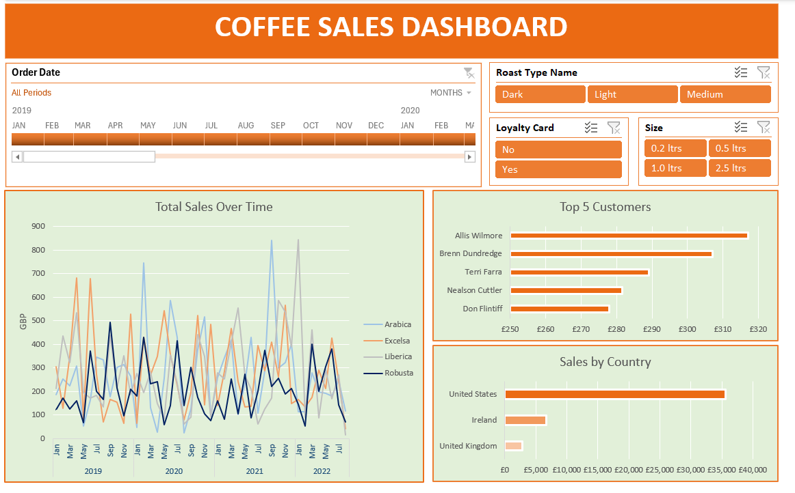

# Coffee Sales Analysis

## Table of Contents
- [Project Overview](Project-Overview) 
- [Data Source](Data-Source)
- [Objectives](Objectives)
- [Tools](Tools)
- [Data Cleaning/Preparation](Data-Cleaning/Preparation)
- [Results](Results)
- [Insights](Insights)
- [Recommendations](Recommendations)

### Project Overview 
Welcome to the Coffee Sales Dashboard project! This repository contains a comprehensive analysis of coffee sales data, presented through an interactive dashboard created using Excel. The dashboard provides insights into sales trends, top customers, and country-specific sales data, making it a valuable tool for business decision-making.

### Data Source
The Dataset used for this analysis is the "coffeeOrdersData.xlsx" file, containing detailed information about each sales made by the country. 

### Objectives
The primary objectives of this project are:

- To create a dynamic Excel dashboard to visualize coffee sales data over time.
- To identify top customers based on sales.
- To analyze sales distribution across different countries.
- To offer a user-friendly interface for exploring sales data based on various filters such as Date, Coffee Roast type, Loyalty card status, and Product size.

### Tools
- Excel 

### Data Cleaning/Preparation
In the initial data preparation phase, we performed the following tasks:
1. Data loading and inspection.
2. Handling of missing data.
3. Data cleaning and formatting.
4. Carrying out Advanced Excel techniques - Xlookup, Index Match, Data validation and Pivot tables.

### Results
>Key Features
1. **Total Sales Over Time:**
- Visual representation of sales trends from January 2019 to July 2022.
- Sales data segregated by different coffee types: Arabica, Excelsa, Liberica, and Robusta.

2. **Top 5 Customers:**
- Bar chart highlighting the top 5 customers by sales value.
- Provides insights into key customer contributions to overall sales.

3. **Sales by Country:**
- Comparative analysis of sales across different countries - United States, Ireland, and United Kingdom.
 
4. **Interactive Filters:**
- Order Date: Select specific time periods to analyze sales.
- Roast Type: Filter data based on the type of roast (Dark, Light, Medium).
- Loyalty Card: Segment data by customers with or without a loyalty card.
- Size: Filter sales based on product size.

### Insights

### Recommendations

